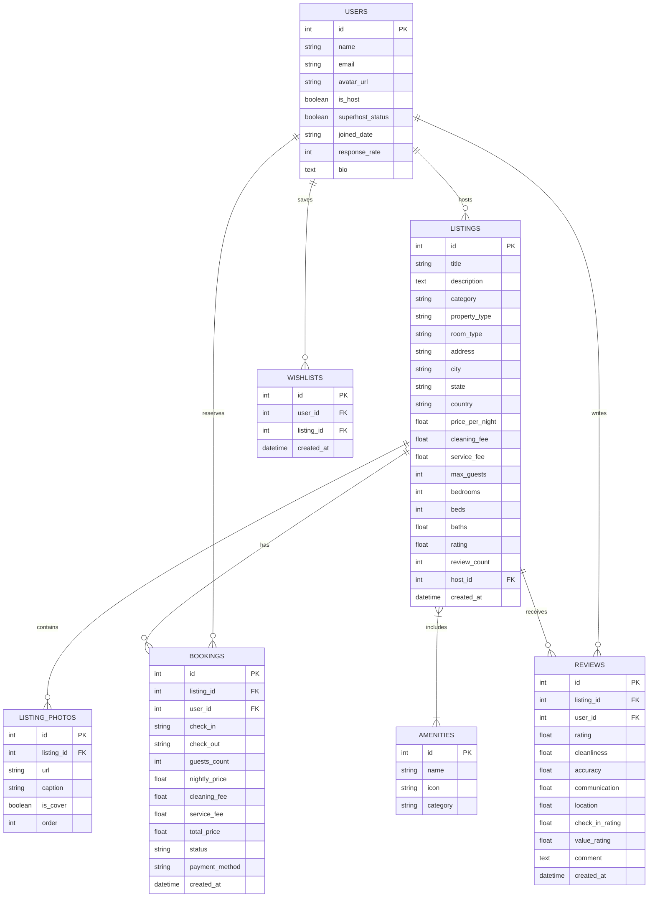

# 🏡 Airbnb Web Application Clone (Fullstack SDE Assignment)

A functional, pixel-perfect clone of the **Airbnb** web application built with **Next.js (TypeScript)**, **Tailwind CSS**, **Python FastAPI**, and **SQLite**. The platform replicates Airbnb's design, user experience, and core browse, search, booking, wishlist, review, and host management workflows.

---

## 🌟 Highlights & Key Features

### 1. 🔍 Home & Explore Search Marketplace
- **Airbnb Header & Search Pill**: Interactive Search Modal supporting destination city search, date range selection (`check_in` to `check_out`), and guest count picker (Adults, Children, Infants, Pets).
- **Categories Bar**: Horizontally scrollable Airbnb category bar with icons (*Beachfront, Cabins, Mansions, OMG!, Countryside, Lakefront, Amazing pools, Icons*) with active selection states.
- **Filters Modal**: Comprehensive filter controls for price range min/max sliders, property types (*Villa, Chalet, Mansion, Dome, Cave House, Chateau, Treehouse*), and bedrooms count.
- **Listing Cards**: High-res photo carousel/slider with swipe arrows, wishlist heart toggle animation, rating star score, location title, nightly pricing, and Superhost/Guest Favorite badges.

### 2. 🏠 Listing Detail Page (`/listings/[id]`)
- **5-Photo Mosaic Grid**: 1 large cover photo + 4 grid photos with a **"Show all photos"** lightbox gallery modal overlay.
- **Host Information & Highlights**: Host avatar, Superhost status, dedicated workspace, self check-in, free cancellation terms, and detailed property descriptions.
- **Amenities**: Categorized amenities grid + **"Show all amenities"** popup modal.
- **Sticky Booking Widget**:
  - Interactive Date-Range Picker (Check-in & Check-out).
  - Live backend availability validation preventing double bookings on already reserved dates.
  - Price calculation breakdown: `Nightly rate × Nights + Cleaning fee + Airbnb service fee = Total Price`.
- **Ratings & Reviews**: Overall rating score, category aspect gauges (*Cleanliness, Accuracy, Communication, Location, Check-in, Value*), guest review cards, and **"Write a Review"** form.

### 3. ✈️ Booking Flow & "My Trips" (`/trips`)
- **Date Range Conflict Validation**: Real-time checking against database to block unavailable date selections.
- **Mocked Checkout Confirmation**: Interactive trip summary, price breakdown, mocked payment method selector (*Credit Card / Apple Pay*), and instant booking confirmation.
- **"My Trips" Dashboard**: View confirmed guest reservations, trip dates, paid total, cancellation capability (which releases blocked dates in DB), and review posting.

### 4. 🔑 Host Experience & CRUD Dashboard (`/host`)
- **Host Analytics Dashboard**: Overview stats for *Total Earnings ($)*, *Active Listings*, *Total Reservations*, and *Average Rating*.
- **Listing Management**: View host-owned properties with options to **View**, **Edit**, or **Delete** properties.
- **Host Reservations Manager**: View incoming guest bookings for host properties.
- **Create Listing Wizard (`/host/create`)**: Intuitive form to publish new properties with title, category, property type, street address, city, specs, pricing, photos (URLs), and amenities.

### 5. ❤️ Wishlists & Favorites (`/wishlists`)
- Save favorite properties from home grid or detail page with persistent wishlist state and toast notifications.

---

## 🛠️ Tech Stack

| Layer | Technology |
| :--- | :--- |
| **Frontend Framework** | Next.js 14+ (App Router, TypeScript, React 19) |
| **Styling & Icons** | Tailwind CSS v4, Lucide React Icons, Geist Sans Typography |
| **Backend Framework** | Python 3.11, FastAPI, Uvicorn ASGI Server |
| **Database & ORM** | SQLite (`airbnb.db`), SQLAlchemy ORM, Pydantic v2 validation |
| **API Client** | Axios REST service |

---

## 📐 Database Schema Architecture



---

## ⚡ Quick Start & Setup Instructions

### Prerequisites
- **Node.js**: v18+ (Node 24 recommended)
- **Python**: 3.9+ (Python 3.11 recommended)

---

### Step 1: Set Up and Run Python Backend

```bash
# 1. Navigate to backend directory
cd backend

# 2. Install Python dependencies
pip install -r requirements.txt

# 3. Seed database with realistic properties, photos, hosts, and reviews
python seed.py

# 4. Launch FastAPI server (Runs at http://localhost:8000)
python -m uvicorn main:app --port 8000 --reload
```

> **FastAPI Interactive API Docs**: Once running, visit [`http://localhost:8000/docs`](http://localhost:8000/docs) to view Swagger UI.

---

### Step 2: Set Up and Run Next.js Frontend

```bash
# 1. Open a new terminal and navigate to frontend directory
cd frontend

# 2. Install dependencies (if not already installed)
npm install

# 3. Launch Next.js local development server (Runs at http://localhost:3000)
npm run dev
```

Visit [`http://localhost:3000`](http://localhost:3000) in your browser!

---

## 🔌 REST API Endpoints Overview

| Method | Endpoint | Description |
| :--- | :--- | :--- |
| `GET` | `/api/listings` | Filtered search by city, dates, category, min/max price, guests, property type |
| `GET` | `/api/listings/{id}` | Get full listing detail with host, photos, amenities |
| `POST` | `/api/listings` | Host create new property listing |
| `PUT` | `/api/listings/{id}` | Host update property details |
| `DELETE` | `/api/listings/{id}` | Host delete property listing |
| `POST` | `/api/listings/{id}/check-dates` | Validate date availability against existing bookings |
| `POST` | `/api/bookings` | Create new guest booking reservation |
| `GET` | `/api/bookings/my-trips` | Get guest's bookings list |
| `POST` | `/api/bookings/{id}/cancel` | Cancel reservation (releases blocked dates) |
| `POST` | `/api/listings/{id}/reviews` | Post a guest review and recalculate rating |
| `GET` | `/api/wishlists` | Get user saved wishlist properties |
| `POST` | `/api/wishlists/toggle/{id}` | Add or remove property from wishlist |
| `GET` | `/api/host/stats` | Get host dashboard earnings, reservations count, and average rating |

---

## 🎨 UI/UX Design System Notes
- **Color Palette**: Airbnb Coral Red (`#FF385C`), Crimson (`#E00B41`), Neutral Dark Gray (`#222222`), Soft Gray Borders (`#E5E7EB`).
- **Typography**: Geist / Inter sans-serif with strong hierarchy.
- **Interactions**: Smooth hover scale on cards, sticky headers with backdrop blur, glassmorphism modal backdrops, micro-animations for wishlist hearts and toast notifications.
